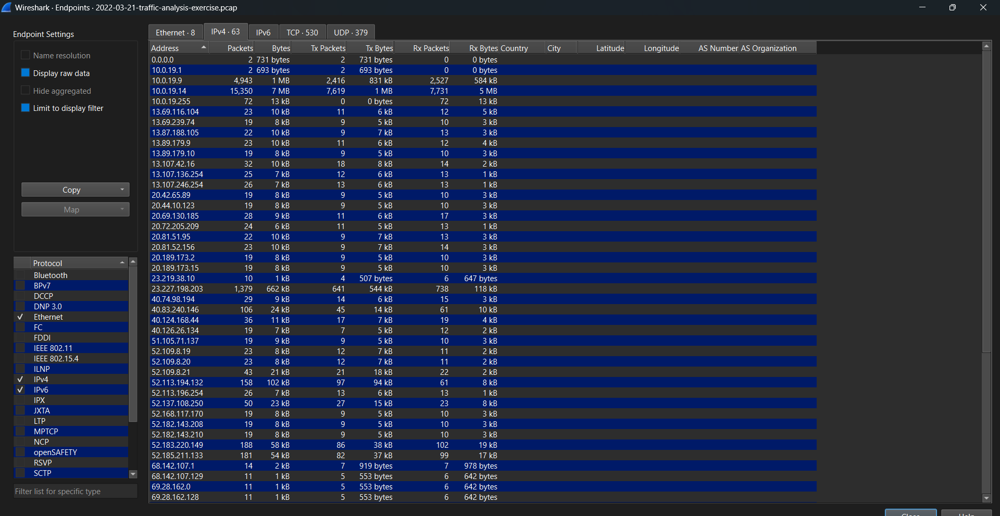
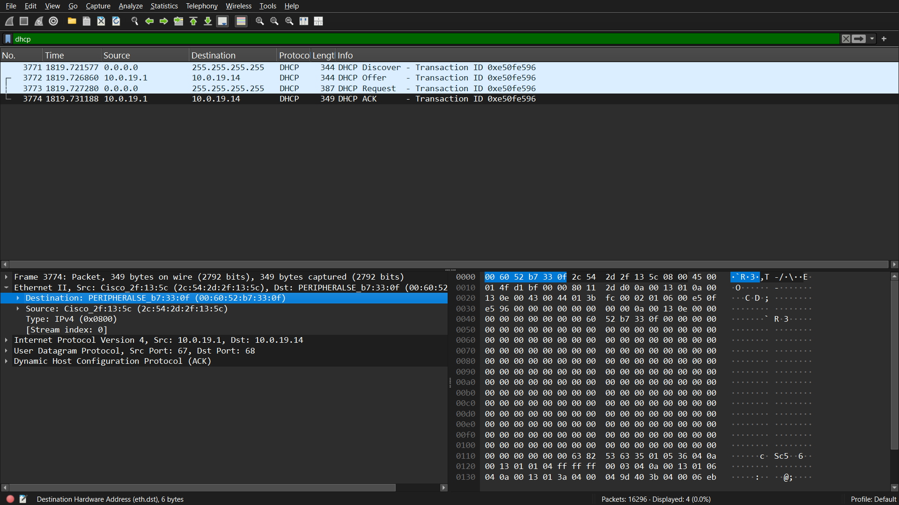
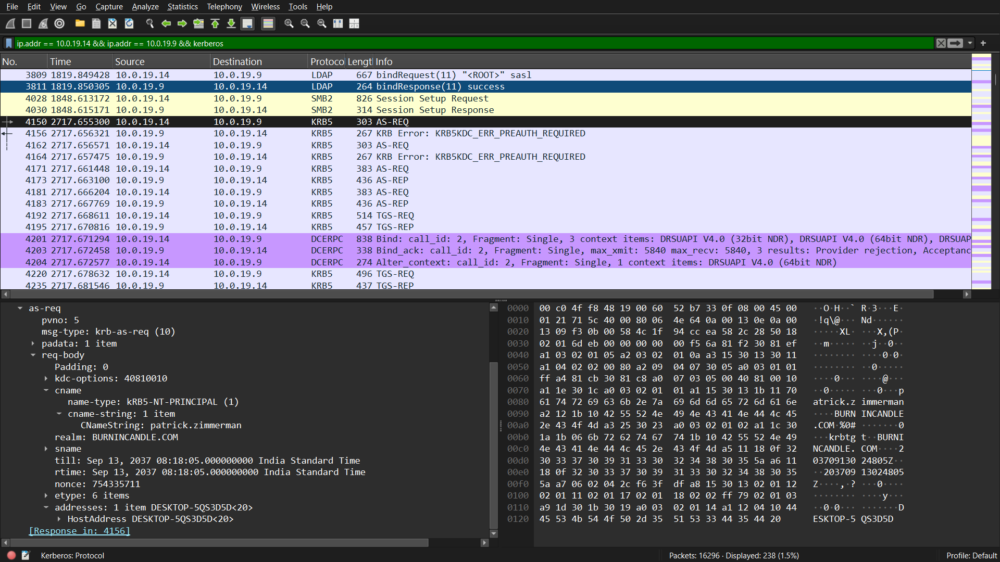
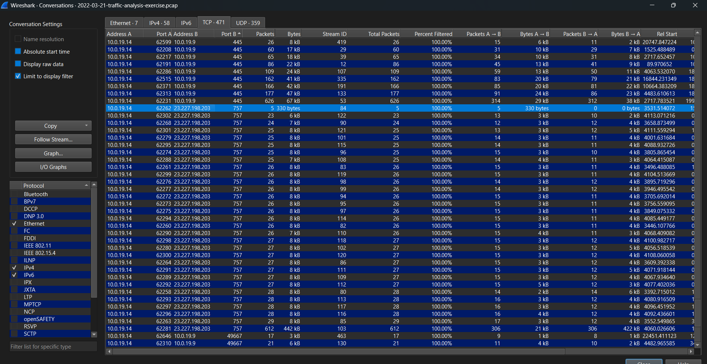
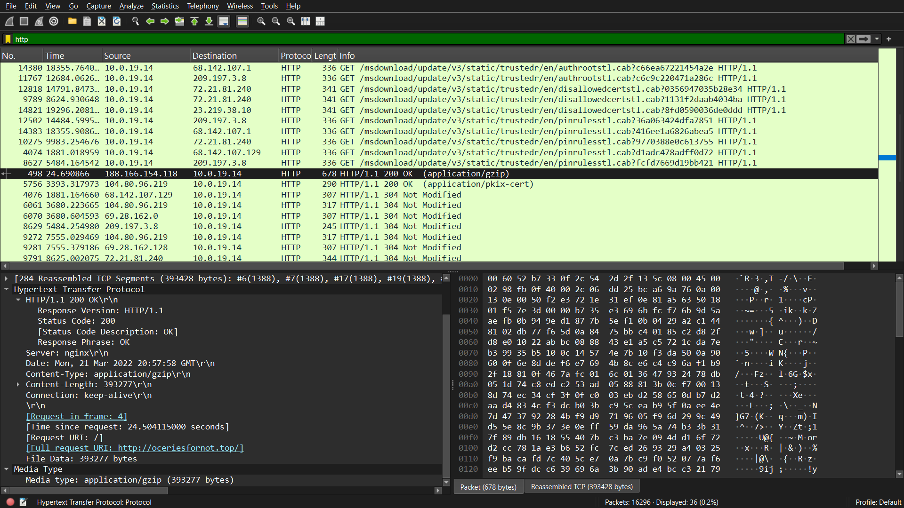
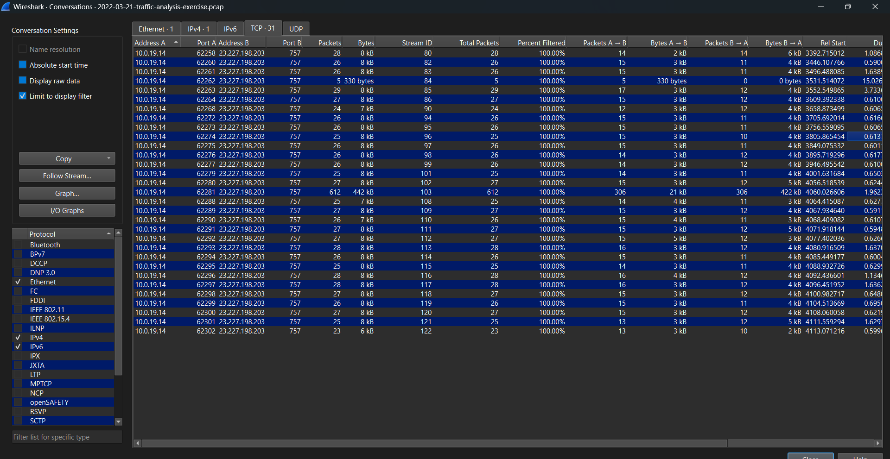
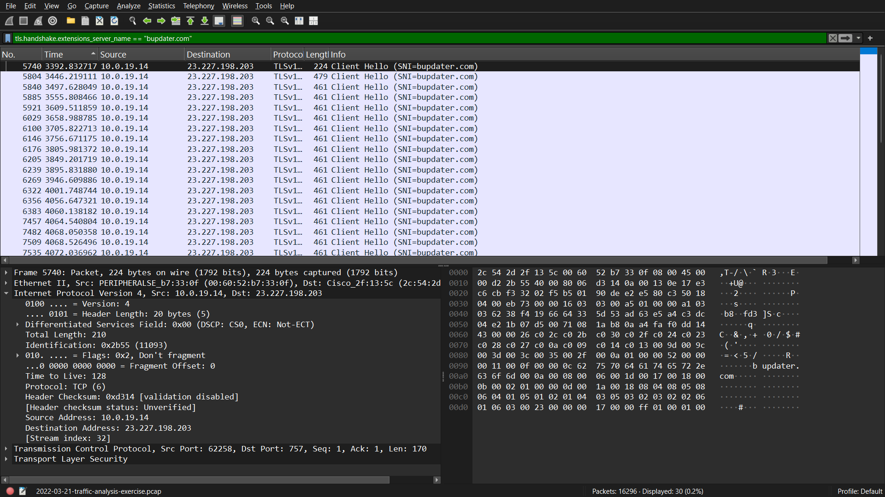
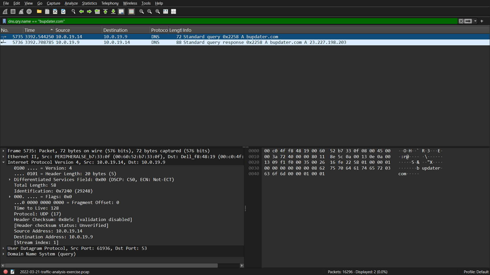

# Wireshark Network Traffic Investigation

## PCAP Source

Malware-Traffic-Analysis.net

2022-03-21 - Traffic Analysis Exercise

https://www.malware-traffic-analysis.net/2022/03/21/index.html

## Objective

Analyze the PCAP to identify the affected endpoint, investigate suspicious network activity, and identify relevant indicators of compromise.

## Victim Details

- IP Address: 10.0.19.14
- MAC Address: 00:60:52:b7:33:0f
- Hostname: DESKTOP-5QS3D5D
- Domain: mshome.net
- Username: Patrick.zimmerman

## Investigation

### 1. Host Identification

The host `10.0.19.14` generated the majority of the traffic in the capture and was selected for further investigation.

DHCP traffic was used to identify the host information.

### 2. DNS Activity

The victim queried the internal DNS server `10.0.19.9` for:

`bupdater.com`

The DNS response resolved the domain to:

`23.227.198.203`

### 3. HTTP / Malware Delivery

HTTP traffic from the victim showed activity involving external resources and a file transfer.

This traffic was reviewed as part of the infection analysis.

### 4. Suspicious Connection

The victim repeatedly communicated with:

- Destination IP: `23.227.198.203`
- Destination Port: `757/TCP`

The connections used TLS and presented:

`bupdater.com`

as the server name indication (SNI).

### 5. Repeated Communication

Multiple short-lived connections were observed between `10.0.19.14` and `23.227.198.203:757`.

This repeated communication was considered suspicious and was investigated as part of the incident.

## Indicators of Compromise

### IP Addresses

- `23.227.198.203`

### Domain

- `bupdater.com`

### Port

- `757/TCP`

## MITRE ATT&CK

- T1105 – Ingress Tool Transfer
- T1071.001 – Web Protocols

## Conclusion

The PCAP analysis identified `10.0.19.14` as the affected endpoint. The host resolved `bupdater.com` to `23.227.198.203` and subsequently established repeated TLS connections to the same destination over TCP port 757.

The observed DNS, HTTP, and TLS activity provides evidence of suspicious network communication associated with the infection activity in the capture.

## Recommended Response

- Isolate the affected endpoint.
- Block confirmed malicious IPs and domains.
- Search the environment for the identified IOCs.
- Review endpoint activity around the infection timeline.
- Reset affected credentials if compromise is confirmed.

## Evidence

### Traffic Volume

### MAC Address / DHCP

### Username and Hostname

### Notable Connection

### Malware Delivery

### TCP Conversation

### bupdater.com SNI

### DNS Query

